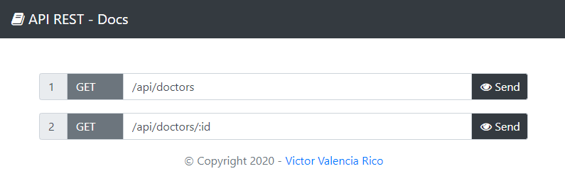
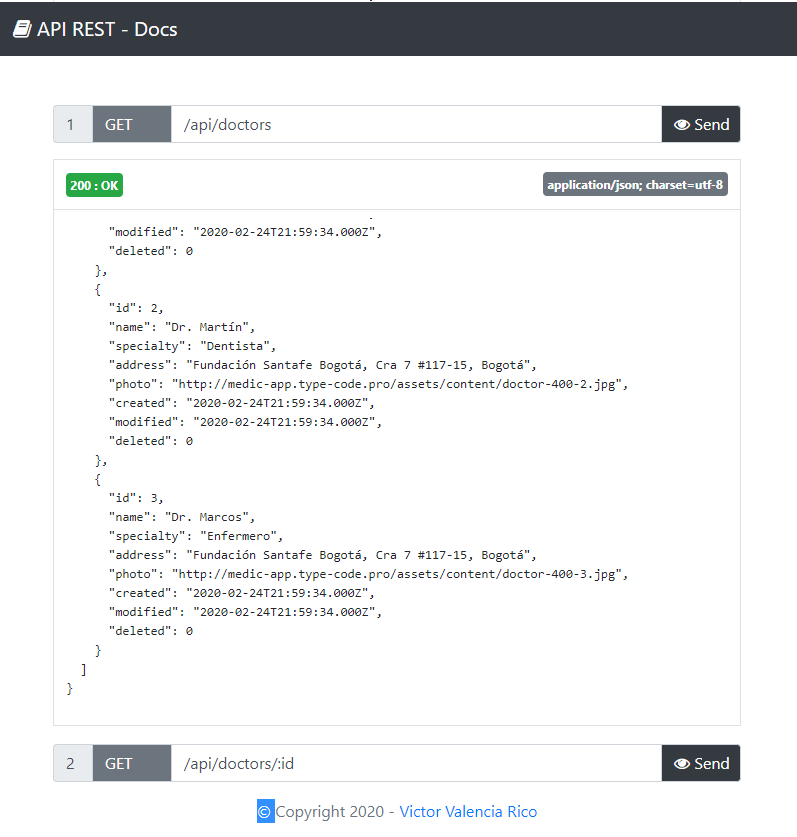

# REST-Docs

RESTful HTTP client library + Docs to test API REST.

# [REST-Docs](http://victor-valencia.github.io/rest-docs)


## Table of contents
- [Install](#install)
- [Usage](#usage)
- [Run](#run)
- [Author](#author)
- [License](#license)

## Install

```bash
npm install rest-docs
```

## Usage

```javascript
// server.js
const rest_docs = require('rest-docs');
var rest = new rest_docs();

const config = {

  SERVER: {
    IP: 'localhost',
    PORT: '8000',
    NAME: 'localhost:8000'
  },
  DATABASE: {
    host: 'localhost',
    user: 'root',
    password: '',
    database: 'database'    
  }

}

rest.setConfig(config)

rest.startServer()

const api = {

  base: '/api/',
  routes: [
    {      
      table: 'doctors',
      event: 'DOCTOR',
      methods: ['GET'],
      columns: [
          {name: 'id', primary: true},
          {name: 'name'},
          {name: 'specialty'},
          {name: 'address'},
          {name: 'photo'}
      ]
    }
  ]

}

rest.buildRoutes(api)
```
API Docs:

* GET /api/docs


API Test:



## Run

```bash
node server.js
```

## Author

@[victor-valencia](https://github.com/victor-valencia).

## License

Licensed under the MIT license.